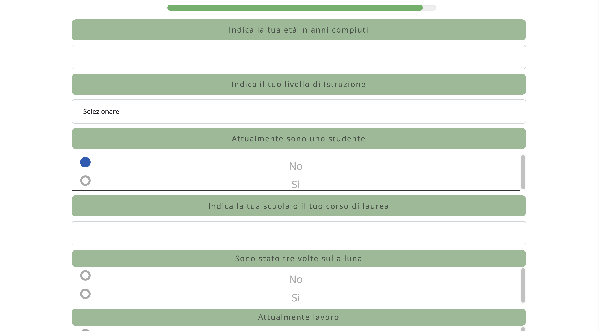

### La sovrapposizione cognitiva tra le rappresentazioni del se’ e dell’ingroup
#### Un test empirico sull’identificazione nazionale.
###### Università di Palermo - Esperimento di tesi magistrale

 
 
Progetto di tesi sperimentale magistrale realizzato in collaborazion con il CNR e l'università degli studi di Palermo.

L'applicazione è stata sviluppata a partire dal codice inizalmente fornito dal dott. Gianluca Merlo.
 
 

### Collaboratori

- prof. Alberto Mirisola in qualità di relatore
- dott. Gianluca Merlo, ricercatore del CNR
   

### Sviluppato con

- HTML, CSS
- Javascript framework JsPysch
- PHP
 

### Gallery
 

 

 

 

 
